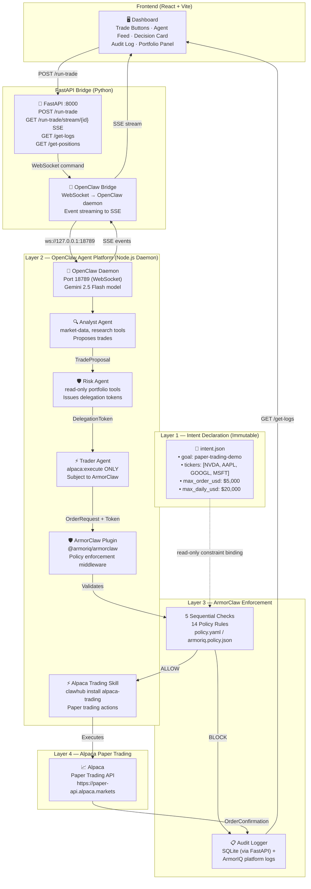

# AuraTrade — Multi-Agent AI Trading Safety System
## Architecture Document v2.0

> **System Name:** AuraTrade  
> **Agent Platform:** OpenClaw (Node.js daemon + ArmorClaw plugin)  
> **Enforcement Layer:** ArmorClaw (`@armoriq/armorclaw`)  
> **Trading Skill:** Alpaca Trading Skill (ClawHub)  
> **LLM:** Gemini 2.5 Flash (free tier)  
> **Status:** Paper Trading Only — No Real Money

---

## Table of Contents

1. [System Overview](#1-system-overview)
2. [What OpenClaw Actually Is](#2-what-openclaw-actually-is)
3. [Layer Diagram](#3-layer-diagram)
4. [Component Breakdown](#4-component-breakdown)
5. [Agent Specifications](#5-agent-specifications)
6. [ArmorClaw Enforcement Flow](#6-armorclaw-enforcement-flow)
7. [Policy Rules Reference](#7-policy-rules-reference)
8. [Delegation Token Lifecycle](#8-delegation-token-lifecycle)
9. [OpenClaw Setup & Integration](#9-openclaw-setup--integration)
10. [Happy Path Trace — BUY NVDA $4000](#10-happy-path-trace--buy-nvda-4000)
11. [Blocked Path Trace — BUY NVDA $8000](#11-blocked-path-trace--buy-nvda-8000)
12. [Audit Log Schema](#12-audit-log-schema)
13. [Directory Structure](#13-directory-structure)
14. [API Endpoint Reference](#14-api-endpoint-reference)
15. [Frontend Component Tree](#15-frontend-component-tree)
16. [Setup & Run Instructions](#16-setup--run-instructions)
17. [Policy Configuration (policy.yaml)](#17-policy-configuration-policyyaml)
18. [Security Assumptions & Limitations](#18-security-assumptions--limitations)
19. [Multi-LLM Support](#19-multi-llm-support)

---

## 1. System Overview

AuraTrade is a multi-agent AI trading safety system engineered around a _safety-first, enforcement-first_ design philosophy.

**The core insight:** Separate _intelligence_ (agents reasoning about what to do) from _execution authority_ (ArmorClaw as the only entity that can authorize real trades).

```
User Intent (immutable intent.json)
        ↓
OpenClaw Agent Platform (Analyst → Risk → Trader pipeline)
        ↓
ArmorClaw Plugin (5 sequential checks, 14 policy rules)
        ↓
Alpaca Paper Trading API (only receives ArmorClaw-approved orders)
```

Even a fully compromised or hallucinating agent **cannot** place an unauthorized order — because it never talks to Alpaca directly. Every order goes through ArmorClaw first.

---

## 2. What OpenClaw Actually Is

> **Critical clarification for anyone reading this code:**

OpenClaw is **not a Python library**. It is a **Node.js autonomous AI agent platform** — a persistent daemon that runs on your machine, connects to messaging platforms (Telegram, Slack, Discord, etc.), and executes tasks using a skill/tool system.

```
Traditional assumption:          Reality:
─────────────────────────        ────────────────────────────────────────
from openclaw import ...   →     npm install -g openclaw
Python agent classes       →     Node.js daemon (openclaw onboard)
pip install armorclaw      →     openclaw plugins install @armoriq/armorclaw
Roll-your-own tools        →     clawhub install alpaca-trading (pre-built skill)
Custom policy code         →     ~/.openclaw/armoriq.policy.json (declarative)
```

**ArmorClaw** is the `@armoriq/armorclaw` npm plugin published by [ArmorIQ](https://armoriq.ai). It installs into the OpenClaw runtime and intercepts every tool call before execution — acting as a cryptographic firewall. Policy is defined in a structured JSON/YAML file, not in `if/else` code.

**The Alpaca Trading Skill** is a pre-built skill from [ClawHub](https://clawhub.io) that gives OpenClaw the ability to place Alpaca paper trades. You install it with `clawhub install alpaca-trading` — you don't write Alpaca REST wrappers yourself.

---

## 3. Layer Diagram



---

## 4. Component Breakdown

### Layer 0 — Frontend Dashboard (React + Vite)

| Component | Responsibility |
|-----------|---------------|
| Trade Trigger Panel | Two buttons: "Run Allowed Trade (BUY NVDA $4K)" and "Trigger Blocked Trade (BUY NVDA $8K)" |
| Agent Activity Feed | SSE stream showing real-time Analyst → Risk → Trader → ArmorClaw event flow |
| ArmorClaw Decision Card | Animated ALLOW (green) or BLOCK (red) with rule IDs and block reason |
| Audit Log Table | Live-polling table of all SQLite audit entries with ALLOW/BLOCK filter |
| Portfolio Panel | Alpaca positions + total equity, refreshed every 10 seconds |

### Layer 1 — Intent Declaration

| Component | Responsibility | Interface |
|-----------|---------------|-----------|
| `intent.json` | Single source of truth for ALL policy constraints | Read-only file; hash verified by ArmorClaw on every request |
| Intent Loader | Validates `intent.json` against Pydantic schema at FastAPI startup | Raises `IntentValidationError` on schema mismatch |

**Key fields:**
```json
{
  "goal": "paper-trading-demo",
  "authorized_tickers": ["NVDA", "AAPL", "GOOGL", "MSFT"],
  "risk_tolerance": "moderate",
  "max_order_usd": 5000,
  "max_daily_usd": 20000,
  "intent_version": "1.0.0",
  "intent_token_id": "auratrade-intent-v1-2024"
}
```

### Layer 2 — OpenClaw Agent Platform

| Component | Responsibility |
|-----------|---------------|
| **OpenClaw Daemon** | Node.js runtime (`~/openclaw-armoriq/`), runs on port 18789 |
| **ArmorClaw Plugin** | `@armoriq/armorclaw` npm plugin — intercepts every tool call as middleware |
| **Alpaca Trading Skill** | ClawHub skill providing `alpaca:place_order`, `alpaca:get_positions`, `alpaca:get_account` |
| **Gemini 2.5 Flash** | LLM for agent reasoning — connected via `google/gemini-2.5-flash` model config |
| **Analyst Agent** | Proposes trades using `market-data` and `research` tools |
| **Risk Agent** | Reads portfolio (read-only) and issues HMAC-signed delegation tokens |
| **Trader Agent** | Submits orders to ArmorClaw (never directly to Alpaca) |

### Layer 3 — ArmorClaw Enforcement Engine

| Component | Responsibility |
|-----------|---------------|
| **Check Engine** | Runs 5 sequential enforcement checks against every order |
| **Policy Evaluator** | Applies 14 named rules from `armoriq.policy.json` per relevant check |
| **Audit Log Writer** | Writes to both ArmorIQ platform logs and our SQLite for dashboard display |
| **Token Validator** | HMAC-SHA256 signature verification, expiry check, replay protection |
| **Intent Binder** | Compares order fields against loaded `intent.json` constraints |

### Layer 4 — Alpaca Paper Trading

| Component | Responsibility |
|-----------|---------------|
| Alpaca REST Client | Submits ArmorClaw-approved orders; fetches positions/account via ClawHub skill |
| Position Cache | Short-lived (5s TTL) position cache in our FastAPI bridge |

---

## 5. Agent Specifications

| Agent | Role | Allowed Tools | Cannot Do | Output |
|-------|------|--------------|-----------|--------|
| **Analyst** | Market Intelligence | `market-data`, `research` | Access accounts, place orders, issue tokens | `TradeProposal { ticker, action, amount_usd, rationale, confidence }` |
| **Risk Agent** | Exposure Gatekeeper | `alpaca:get_positions`, `alpaca:get_account`, `calculate_exposure` | Execute trades, write data, propose trades | `DelegationToken { approved_by, action, ticker, max_amount_usd, expiry, signature }` or `RejectionReason` |
| **Trader** | Order Executor | `alpaca:execute` ONLY (gated by ArmorClaw) | Read market data, propose trades, issue tokens | `OrderRequest` → on ALLOW: `OrderConfirmation`; on BLOCK: `BlockedOrderRecord` |

> **ArmorClaw enforcement note:** Tool bindings are enforced at the ArmorClaw plugin level. If the Trader agent attempts to call `market-data`, the tool call is intercepted by ArmorClaw before any external API is reached, and a `ToolAccessDenied` event is logged.

---

## 6. ArmorClaw Enforcement Flow

ArmorClaw intercepts every outbound tool call and runs five checks **in strict sequence**. Failure at any check immediately blocks the order; subsequent checks are skipped.

```
Tool call arrives at ArmorClaw middleware
       │
       ▼
┌─────────────────────────────────────────────────────────┐
│  CHECK 1 — Intent Binding Verification                  │
│  • Verify order ticker ∈ authorized_tickers             │
│  • Verify order amount ≤ max_order_usd                  │
│  • Verify intent_token_id matches loaded intent.json    │
│  Rule: ticker-universe-restriction, trade-size-limits,  │
│         intent-token-binding                            │
└─────────────────────────────────────────────────────────┘
       │ PASS
       ▼
┌─────────────────────────────────────────────────────────┐
│  CHECK 2 — Delegation Token Validation                  │
│  • Verify HMAC-SHA256 signature                         │
│  • Verify expiry > now (60s TTL)                        │
│  • Verify approved_by == "RiskAgent"                    │
│  • Verify handoff_count == 1                            │
│  • Verify sub_delegation_allowed == false               │
│  • Verify token.action/ticker match order fields        │
│  Rule: delegation-scope-enforcement, agent-role-binding │
└─────────────────────────────────────────────────────────┘
       │ PASS
       ▼
┌─────────────────────────────────────────────────────────┐
│  CHECK 3 — Exposure & Concentration                     │
│  • Post-trade single-ticker concentration < 40%         │
│  • Post-trade sector exposure < 60%                     │
│  • Daily spend so far + order ≤ max_daily_usd           │
│  Rule: portfolio-concentration-limit, sector-exposure,  │
│         trade-size-limits (daily)                       │
└─────────────────────────────────────────────────────────┘
       │ PASS
       ▼
┌─────────────────────────────────────────────────────────┐
│  CHECK 4 — Regulatory & Temporal Rules                  │
│  • NYSE market hours: 09:30–16:00 ET, Mon–Fri           │
│  • No earnings announcement within ±2 days              │
│  • No wash-sale within 30 days                          │
│  Rule: market-hours-only, earnings-blackout-window,     │
│         wash-sale-prevention                            │
└─────────────────────────────────────────────────────────┘
       │ PASS
       ▼
┌─────────────────────────────────────────────────────────┐
│  CHECK 5 — Data & Tool Access Audit                     │
│  • Confirm order origin: TraderAgent                    │
│  • Confirm no restricted data class accessed            │
│  • Confirm Trader used only alpaca:execute              │
│  • Confirm file access within scoped directory          │
│  Rule: agent-role-binding, tool-restrictions,           │
│         data-class-protection, directory-scoped-access  │
└─────────────────────────────────────────────────────────┘
       │ ALLOW
       ▼
  Forward to Alpaca Paper Trading API
  Write ALLOW audit entry (with SHA-256 proof_hash)
```

---

## 7. Policy Rules Reference

Each rule is defined in `config/armoriq.policy.json` (ArmorClaw declarative format) AND implemented as a named Python function in `backend/armorclaw/policy_rules.py` (defense-in-depth via FastAPI bridge).

| Rule ID | Group | What It Checks | Block Condition |
|---------|-------|---------------|-----------------|
| `trade-size-limits` | Trade & Exposure | Order amount vs `max_order_usd` and daily spend vs `max_daily_usd` | `order_usd > 5000` OR `daily_spent + order_usd > 20000` |
| `portfolio-concentration-limit` | Trade & Exposure | Post-trade % of single ticker | Single ticker would exceed 40% of portfolio |
| `sector-exposure-limit` | Trade & Exposure | Post-trade sector weight | Tech sector would exceed 60% of portfolio |
| `ticker-universe-restriction` | Ticker & Asset | Ticker vs `authorized_tickers` | Ticker not in `["NVDA","AAPL","GOOGL","MSFT"]` |
| `market-hours-only` | Time & Regulatory | Timestamp vs NYSE hours | Request outside 09:30–16:00 ET Mon–Fri |
| `earnings-blackout-window` | Time & Regulatory | Request date vs earnings ±2 days | Trade within 2 days of earnings announcement |
| `wash-sale-prevention` | Time & Regulatory | Last sell date vs today | Sell within 30 days of prior loss sale |
| `data-class-protection` | Data & File | Data classification of accessed data | RESTRICTED/CONFIDENTIAL data accessed without authorization |
| `directory-scoped-access` | Data & File | File system paths | Access outside `/data/agents/` |
| `tool-restrictions` | Tool Restrictions | Tool calls vs agent's declared list | Agent called a tool not in its role's allowlist |
| `delegation-scope-enforcement` | Delegation & Role | Token fields vs order fields | `token.ticker ≠ order.ticker` OR `order_usd > token.max_amount_usd` |
| `agent-role-binding` | Delegation & Role | Order origin agent identity | Order not submitted by registered Trader agent |
| `intent-token-binding` | Delegation & Role | `intent_token_id` vs loaded intent.json hash | IDs mismatch — possible intent.json tampering |
| `risk-agent-read-only` | Delegation & Role | Write tools called by Risk Agent | Risk agent called any non-read-only tool |

---

## 8. Delegation Token Lifecycle

### 8.1 Schema

```json
{
  "token_id":               "uuid-v4",
  "approved_by":            "RiskAgent",
  "action":                 "BUY",
  "ticker":                 "NVDA",
  "max_amount_usd":         4000,
  "expiry":                 "2024-01-15T14:31:00Z",
  "issued_at":              "2024-01-15T14:30:00Z",
  "handoff_count":          1,
  "sub_delegation_allowed": false,
  "intent_token_id":        "auratrade-intent-v1-2024",
  "signature":              "<HMAC-SHA256 of all above fields>"
}
```

### 8.2 Issuance (Risk Agent)

1. Risk Agent completes read-only exposure checks
2. Token factory populates all fields from validated TradeProposal
3. Sets `expiry = now() + 60 seconds`, `handoff_count = 1`, `sub_delegation_allowed = false`
4. HMAC-SHA256 signed with `ARMORCLAW_SECRET_KEY`
5. Token passed to Trader Agent in-process (never written to disk)

### 8.3 Validation (ArmorClaw — Check 2)

1. Recompute HMAC-SHA256 → compare with `token.signature` → FAIL if mismatch
2. Check `expiry > datetime.utcnow()` → FAIL if expired
3. Assert `approved_by == "RiskAgent"` → FAIL if other
4. Assert `handoff_count == 1` → FAIL if > 1 (relay attack prevention)
5. Assert `sub_delegation_allowed == false` → FAIL if true
6. Assert `token.action == order.action AND token.ticker == order.ticker`
7. Assert `order.amount_usd ≤ token.max_amount_usd`

### 8.4 Replay Protection

Token IDs are stored in a short-lived `used_tokens` set. Replayed token → immediate BLOCK.

---

## 9. OpenClaw Setup & Integration

### 9.1 Architecture of the Integration

```
React Dashboard (port 5173)
        │
        │ HTTP /run-trade, SSE /run-trade/stream/{id}
        ▼
FastAPI Bridge (port 8000)  ← Our Python code
        │
        │ WebSocket ws://127.0.0.1:18789
        ▼
OpenClaw Daemon (Node.js)   ← Real OpenClaw runtime
        │
        ├── ArmorClaw Plugin (@armoriq/armorclaw)
        │       └── Intercepts every tool call
        │
        └── Alpaca Trading Skill (from ClawHub)
                └── Places real paper orders
```

### 9.2 Installation (WSL2 or Git Bash on Windows)

**Step 1: Get required API keys**
| Key | Where |
|-----|-------|
| ArmorIQ API key | https://platform.armoriq.ai (free) |
| Gemini API key  | https://aistudio.google.com (free, 1500 req/day) |
| Alpaca Paper key | https://app.alpaca.markets (free) |

**Step 2: Run the ArmorIQ installer**
```bash
curl -fsSL https://armoriq.ai/install-armorclaw.sh | bash \
  --gemini-key YOUR_GEMINI_API_KEY \
  --api-key YOUR_ARMORIQ_API_KEY \
  --no-prompt
```
This automatically:
- Clones `openclaw/openclaw` from GitHub
- Builds it with pnpm
- Installs `@armoriq/armorclaw` npm plugin
- Writes `~/.openclaw/openclaw.json` config

**Step 3: Install the Alpaca Trading Skill**
```bash
clawhub install lacymorrow/alpaca-trading-skill
# Then configure Alpaca keys:
export APCA_API_KEY_ID="your_paper_key"
export APCA_API_SECRET_KEY="your_paper_secret"
export APCA_API_BASE_URL="https://paper-api.alpaca.markets"
```

**Step 4: Start the OpenClaw daemon**
```bash
openclaw onboard --install-daemon
# Daemon now runs on ws://127.0.0.1:18789
```

**Step 5: Verify ArmorClaw is active**
```bash
openclaw doctor
# Should show: ✅ armorclaw plugin enabled
openclaw plugins list
# Should show: @armoriq/armorclaw (active)
```

### 9.3 Policy Configuration

ArmorClaw policy is defined in `~/.openclaw/armoriq.policy.json`. A corresponding `config/armoriq.policy.json` is maintained in this repo for transparency:

```json
{
  "version": "1.0",
  "agent_id": "auratrade-agent-001",
  "policies": [
    {
      "id": "ticker-universe-restriction",
      "type": "tool_restriction",
      "tool": "alpaca:place_order",
      "condition": "args.symbol NOT IN ['NVDA','AAPL','GOOGL','MSFT']",
      "action": "block",
      "message": "Ticker not in authorized universe"
    },
    {
      "id": "trade-size-limits",
      "type": "tool_restriction",
      "tool": "alpaca:place_order",
      "condition": "args.notional > 5000",
      "action": "block",
      "message": "Order exceeds max_order_usd $5,000"
    },
    {
      "id": "market-hours-only",
      "type": "time_restriction",
      "schedule": "09:30-16:00 America/New_York Mon-Fri",
      "action": "block",
      "message": "Trading only 09:30–16:00 ET"
    }
  ]
}
```

### 9.4 FastAPI ↔ OpenClaw Bridge

The Python FastAPI server communicates with the OpenClaw daemon via WebSocket:

```python
# backend/openclaw_bridge.py
import asyncio
import websockets
import json

OPENCLAW_WS = "ws://127.0.0.1:18789"

async def send_trade_command(
    run_id: str, action: str, ticker: str, amount_usd: float, queue: asyncio.Queue
):
    """Send a trade command to OpenClaw; stream ArmorClaw events back."""
    async with websockets.connect(OPENCLAW_WS) as ws:
        command = (
            f"Analyze {ticker} and if conditions are favorable, "
            f"place a paper trade to {action} ${amount_usd:,.0f} of {ticker}."
        )
        await ws.send(json.dumps({
            "type": "agent.send",
            "session": "main",
            "message": command,
            "metadata": {"run_id": run_id}
        }))

        # Stream agent events + ArmorClaw decisions back to SSE queue
        async for raw_message in ws:
            event = json.loads(raw_message)
            await queue.put({"event": "agent_activity", "data": event})
            if event.get("type") == "armorclaw.decision":
                await queue.put({"event": "armorclaw_decision", "data": event})
            if event.get("type") in ("session.complete", "session.error"):
                await queue.put({"event": "done", "data": event})
                break
```

---

## 10. Happy Path Trace — BUY NVDA $4000

> **Scenario:** User clicks "Run Allowed Trade" → BUY NVDA $4,000

```
Step 1  User clicks button in React Dashboard
        POST /run-trade { action: "BUY", ticker: "NVDA", amount_usd: 4000 }

Step 2  FastAPI → OpenClaw WebSocket Bridge
        Command: "Analyze NVDA and place a BUY order for $4,000"
        SSE stream opened: GET /run-trade/stream/{run_id}

Step 3  OpenClaw → Analyst Agent
        market-data tool → NVDA price: $875.40, trend: ↑
        research tool → sentiment: +0.81 (bullish)
        ArmorClaw CHECK 1 & 3 on market-data: PASS (read tool, OK)
        TradeProposal: { BUY, NVDA, $4000, confidence: 0.82 }

Step 4  OpenClaw → Risk Agent
        alpaca:get_positions → NVDA: 12% of portfolio (read-only)
        alpaca:get_account → equity: $48,000
        calculate_exposure → post-trade: ~20% (< 40% limit)
        ArmorClaw CHECK 3 on get_positions: PASS (read-only, OK)
        DelegationToken issued: { HMAC-SHA256, 60s TTL, max $4000 }

Step 5  OpenClaw → Trader Agent
        OrderRequest + DelegationToken → ArmorClaw middleware

Step 6  ArmorClaw — All 5 Checks
        ✅ Check 1: NVDA ∈ authorized, $4000 ≤ $5000 max
        ✅ Check 2: HMAC valid, not expired, approved_by=RiskAgent
        ✅ Check 3: concentration ~20% < 40%, daily $4000 < $20000
        ✅ Check 4: 14:32 ET Wednesday, no earnings blackout
        ✅ Check 5: origin=TraderAgent, tool=alpaca:execute only
        → DECISION: ALLOW

Step 7  ArmorClaw → Alpaca Paper Trading
        POST /v2/orders { symbol: "NVDA", notional: 4000, side: "buy" }
        Alpaca returns: { order_id: "alp-xxx-001", status: "accepted" }

Step 8  Audit + Dashboard
        ALLOW entry written to SQLite with proof_hash chain
        Dashboard: 🟢 ALLOW card, audit log row, portfolio refreshed
```

---

## 11. Blocked Path Trace — BUY NVDA $8000

> **Scenario:** User clicks "Trigger Blocked Trade" → BUY NVDA $8,000 (exceeds $5K cap)

```
Step 1  POST /run-trade { action: "BUY", ticker: "NVDA", amount_usd: 8000 }

Step 2  Analyst produces TradeProposal for $8,000
Step 3  Risk Agent issues DelegationToken with max_amount_usd: 8000
        [Risk Agent is NOT the final authority — ArmorClaw holds hard caps]

Step 4  Trader submits OrderRequest + Token to ArmorClaw

Step 5  ArmorClaw — Check 1 ← 🔴 IMMEDIATE BLOCK
        ❌ $8,000 > max_order_usd $5,000
        Rule fired: trade-size-limits
        Rule fired: intent-token-binding (token max also exceeds intent cap)
        → Checks 2–5 SKIPPED
        → DECISION: BLOCK

Step 6  Audit + Dashboard
        BLOCK entry written: rule_id="trade-size-limits,intent-token-binding"
        Order NOT forwarded to Alpaca. Portfolio unchanged.
        Dashboard: 🔴 BLOCK card, red audit log row
```

---

## 12. Audit Log Schema

Every decision produces an append-only SQLite entry with SHA-256 proof-hash chaining:

| Field | Type | Description |
|-------|------|-------------|
| `id` | `INTEGER` | Auto-incrementing PK |
| `timestamp` | `DATETIME` | UTC time of ArmorClaw decision |
| `run_id` | `UUID v4` | Pipeline run identifier |
| `agent` | `VARCHAR(50)` | Submitting agent name |
| `tool` | `VARCHAR(100)` | Tool call that triggered enforcement |
| `action` | `VARCHAR(10)` | `BUY` or `SELL` |
| `ticker` | `VARCHAR(10)` | Ticker symbol |
| `amount_usd` | `FLOAT` | Order dollar amount |
| `decision` | `VARCHAR(10)` | `ALLOW` or `BLOCK` |
| `rule_id` | `TEXT` (nullable) | Comma-separated fired rule IDs. NULL if ALLOW |
| `block_reason` | `TEXT` (nullable) | Human-readable block explanation. NULL if ALLOW |
| `check_number` | `INTEGER` (nullable) | Which check (1–5) failed first |
| `delegation_token_id` | `UUID v4` (nullable) | Attached delegation token ID |
| `intent_token_id` | `VARCHAR(64)` | Hash of loaded `intent.json` |
| `proof_hash` | `VARCHAR(64)` | SHA-256 of (prev_hash + all fields) — tamper evidence |
| `alpaca_order_id` | `VARCHAR(100)` (nullable) | Alpaca order ID on ALLOW. NULL on BLOCK |

---

## 13. Directory Structure

```
armorclaw-finance-orchestrator/
│
├── intent.json                          ← Immutable intent declaration (Layer 1)
├── ARCHITECTURE.md                      ← This document
├── README.md                            ← Quick start guide
├── .env                                 ← Secret keys (never committed)
├── .env.example                         ← Template
├── requirements.txt                     ← Python backend dependencies
│
├── config/
│   ├── armoriq.policy.json              ← ArmorClaw declarative policy rules
│   └── openclaw.json.example            ← OpenClaw daemon config example
│
├── backend/                             ← Python FastAPI bridge + our own audit layer
│   ├── main.py                          ← FastAPI app + SSE endpoints
│   ├── config.py                        ← LLM factory (get_llm())
│   │
│   ├── openclaw_bridge.py               ← WebSocket client → OpenClaw daemon
│   │
│   ├── agents/                          ← Simulated pipeline (demo mode, no API keys)
│   │   ├── orchestrator.py              ← Async pipeline + SSE event queue
│   │   └── tools/
│   │       ├── analyst_tools.py         ← market-data, research (yfinance + mock)
│   │       └── risk_tools.py            ← get_positions, get_account, calculate_exposure
│   │
│   ├── armorclaw/                       ← Our own Python enforcement layer (defense-in-depth)
│   │   ├── engine.py                    ← 5-check enforcement loop
│   │   ├── policy_rules.py              ← 14 named rule functions
│   │   └── audit_logger.py             ← SHA-256 proof-hash audit writer
│   │
│   ├── alpaca/
│   │   └── client.py                    ← REST client wrapper (5s TTL cache)
│   │
│   └── db/
│       └── database.py                  ← SQLAlchemy + AuditLog ORM model
│
└── website/                             ← React + Vite frontend
    ├── vite.config.js
    ├── package.json
    └── src/
        ├── main.jsx
        ├── App.jsx                       ← Router: / (Landing) + /dashboard
        ├── index.css                     ← Design tokens + global styles
        ├── hooks/
        │   └── useIntersection.js
        ├── pages/
        │   └── Dashboard.jsx             ← All 5 dashboard panels
        └── components/
            ├── Navbar.jsx
            ├── HeroSection.jsx
            ├── StatsSection.jsx
            ├── ArchSection.jsx
            ├── LayersSection.jsx
            ├── PolicySection.jsx
            ├── StackSection.jsx
            └── TerminalSection.jsx
```

---

## 14. API Endpoint Reference

| Method | Path | Description | Response |
|--------|------|-------------|----------|
| `POST` | `/run-trade` | Triggers agent pipeline. Returns `run_id` for SSE stream | `{ run_id, status, sse_url }` |
| `GET` | `/run-trade/stream/{run_id}` | Server-Sent Events stream of agent activity | SSE: `agent_activity`, `armorclaw_decision`, `done` |
| `GET` | `/get-logs` | Query audit log with optional `?decision=ALLOW\|BLOCK&limit=N` | `{ total, entries: [...] }` |
| `GET` | `/get-positions` | Alpaca paper positions + account equity | `{ positions, total_equity }` |
| `GET` | `/health` | Health check | `{ status: "ok", service, version }` |

### SSE Event Types

| Event | Payload | Description |
|-------|---------|-------------|
| `agent_activity` | `{ agent, status, message, ts }` | Analyst/Risk/Trader step update |
| `armorclaw_decision` | `{ decision, ticker, action, amount_usd, rule_id, block_reason, check_number }` | Final ArmorClaw verdict |
| `done` | `{ run_id, final_status }` | Pipeline complete signal |

---

## 15. Frontend Component Tree

```
App.jsx
├── Route "/" → LandingPage
│   ├── <Navbar />
│   ├── <HeroSection />      ← Animated hero + AuraTrade tagline
│   ├── <StatsSection />     ← 14 rules, 5 checks, $5K cap, 3 agents (count-up anims)
│   ├── <ArchSection />      ← LangGraph flow diagram
│   ├── <LayersSection />    ← 4-layer architecture cards
│   ├── <PolicySection />    ← All 14 rules grouped, hover to reveal descriptions
│   ├── <StackSection />     ← Tech stack cards (OpenClaw, ArmorClaw, etc.)
│   └── <TerminalSection />  ← Animated CLI: allowed/blocked/token traces
│
└── Route "/dashboard" → Dashboard.jsx
    ├── TradeTrigger         ← BUY NVDA $4K (green) + BUY NVDA $8K (red) buttons
    ├── AgentFeed            ← SSE stream, real-time agent activity
    ├── DecisionCard         ← ALLOW/BLOCK with animated reveal
    ├── AuditLogTable        ← SQLite entries, 5s auto-refresh, filter dropdown
    └── PositionsPanel       ← Alpaca holdings, 10s refresh
```

---

## 16. Setup & Run Instructions

### Quick Start (Demo Mode — No API Keys Required)

```bash
# 1. Clone the repo
git clone https://github.com/Danielraj5605/armorclaw-finance-orchestrator.git
cd armorclaw-finance-orchestrator

# 2. Copy environment template
cp .env.example .env
# Edit .env — all values have sensible defaults for demo

# 3. Start the Python backend
pip install -r requirements.txt
python -c "from backend.db.database import init_db; init_db()"
uvicorn backend.main:app --host 0.0.0.0 --port 8000

# 4. Start the React frontend
cd website
npm install
npm run dev

# 5. Open http://localhost:5173
```

### Full OpenClaw Integration (WSL2 / Linux / macOS)

```bash
# Step 1: Install OpenClaw + ArmorClaw (requires WSL2 on Windows)
curl -fsSL https://armoriq.ai/install-armorclaw.sh | bash \
  --gemini-key YOUR_GEMINI_KEY \
  --api-key YOUR_ARMORIQ_KEY \
  --no-prompt

# Step 2: Install Alpaca skill
clawhub install lacymorrow/alpaca-trading-skill

# Step 3: Configure Alpaca keys in ~/.env or skill config
echo "APCA_API_KEY_ID=your_paper_key" >> ~/.openclaw/.env
echo "APCA_API_SECRET_KEY=your_paper_secret" >> ~/.openclaw/.env
echo "APCA_API_BASE_URL=https://paper-api.alpaca.markets" >> ~/.openclaw/.env

# Step 4: Copy our policy to OpenClaw config dir
cp config/armoriq.policy.json ~/.openclaw/armoriq.policy.json

# Step 5: Start OpenClaw daemon
openclaw onboard --install-daemon

# Step 6: Verify setup
openclaw doctor
openclaw plugins list

# Step 7: Start FastAPI with OpenClaw bridge enabled
OPENCLAW_MODE=live uvicorn backend.main:app --host 0.0.0.0 --port 8000

# Step 8: Start frontend
cd website && npm run dev
```

### Environment Variables

| Variable | Description | Default |
|----------|-------------|---------|
| `ALPACA_API_KEY` | Alpaca paper trading API key | — |
| `ALPACA_SECRET_KEY` | Alpaca paper trading secret | — |
| `ALPACA_BASE_URL` | Alpaca API base URL | `https://paper-api.alpaca.markets` |
| `GEMINI_API_KEY` | Google Gemini API key (free) | — |
| `LLM_PROVIDER` | LLM provider override | `gemini` |
| `LLM_MODEL` | Model name override | `gemini-2.5-flash-preview` |
| `ARMORCLAW_SECRET_KEY` | HMAC signing secret | `demo-secret-key-32-chars-minimum!` |
| `ARMORIQ_API_KEY` | ArmorIQ platform API key | — |
| `OPENCLAW_WS` | OpenClaw daemon WebSocket URL | `ws://127.0.0.1:18789` |
| `OPENCLAW_MODE` | `live` (real OpenClaw) or `demo` (simulation) | `demo` |
| `DATABASE_URL` | SQLite connection string | `sqlite:///./auratrade_audit.db` |
| `CORS_ORIGINS` | Allowed CORS origins | `http://localhost:5173` |

---

## 17. Policy Configuration (policy.yaml)

This is the **declarative, structured, interpretable** policy used by ArmorClaw — not hardcoded `if/else` logic.

```yaml
# config/policy.yaml
version: "1.0"
agent_id: "auratrade-agent-001"
intent_file: "./intent.json"

rules:
  - id: ticker-universe-restriction
    type: tool_restriction
    tool: "alpaca:place_order"
    condition: "args.symbol NOT IN intent.authorized_tickers"
    action: block
    severity: critical
    message: "Ticker {args.symbol} not in authorized universe {intent.authorized_tickers}"

  - id: trade-size-limits
    type: value_constraint
    tool: "alpaca:place_order"
    condition: "args.notional > intent.max_order_usd"
    action: block
    severity: critical
    message: "Order ${args.notional} exceeds max_order_usd ${intent.max_order_usd}"

  - id: daily-spend-limit
    type: aggregate_constraint
    tool: "alpaca:place_order"
    condition: "daily_spent + args.notional > intent.max_daily_usd"
    action: block
    severity: high
    message: "Daily spend would reach ${daily_spent + args.notional}, limit is ${intent.max_daily_usd}"

  - id: portfolio-concentration-limit
    type: portfolio_constraint
    condition: "(current_position_value + args.notional) / portfolio_value > 0.40"
    action: block
    severity: high
    message: "Post-trade concentration would exceed 40% limit"

  - id: sector-exposure-limit
    type: portfolio_constraint
    condition: "sector_exposure('technology') + args.notional / portfolio_value > 0.60"
    action: block
    severity: high
    message: "Tech sector exposure would exceed 60% limit"

  - id: market-hours-only
    type: time_restriction
    schedule: "09:30-16:00 America/New_York Mon-Fri"
    action: block
    severity: critical
    message: "Trading only permitted 09:30–16:00 ET Mon–Fri"

  - id: earnings-blackout-window
    type: calendar_restriction
    condition: "days_to_earnings(args.symbol) < 2 OR days_since_earnings(args.symbol) < 1"
    action: block
    severity: high
    message: "Trade blocked: earnings blackout window for {args.symbol}"

  - id: wash-sale-prevention
    type: trade_history_constraint
    condition: "action == 'BUY' AND days_since_loss_sell(args.symbol) < 30"
    action: block
    severity: medium
    message: "Wash-sale prevention: sold {args.symbol} at loss within 30 days"

  - id: tool-restrictions
    type: agent_rbac
    bindings:
      AnalystAgent: ["market-data", "research"]
      RiskAgent: ["alpaca:get_positions", "alpaca:get_account", "calculate_exposure"]
      TraderAgent: ["alpaca:execute"]
    action: block
    severity: critical
    message: "{agent} is not authorized to call {tool}"

  - id: delegation-scope-enforcement
    type: token_constraint
    condition: >
      args.ticker != token.ticker OR
      args.action != token.action OR
      args.notional > token.max_amount_usd
    action: block
    severity: critical
    message: "Order fields do not match delegation token scope"

  - id: agent-role-binding
    type: identity_check
    condition: "submitting_agent != 'TraderAgent'"
    action: block
    severity: critical
    message: "Only TraderAgent may submit orders to execution"

  - id: intent-token-binding
    type: integrity_check
    condition: "request.intent_token_id != loaded_intent.intent_token_id"
    action: block
    severity: critical
    message: "intent_token_id mismatch — possible intent.json tampering"

  - id: risk-agent-read-only
    type: agent_rbac
    agent: "RiskAgent"
    forbidden_tools: ["alpaca:execute", "alpaca:place_order", "alpaca:cancel_order"]
    action: block
    severity: critical
    message: "RiskAgent attempted to call a write tool — read-only violation"

  - id: data-class-protection
    type: data_classification
    forbidden_classes: ["RESTRICTED", "CONFIDENTIAL", "PII"]
    action: block
    severity: high
    message: "Data class {data_class} not accessible to agent {agent}"
```

---

## 18. Security Assumptions & Limitations

### ✅ What This System Protects Against

- **Oversized individual orders** — Hard $5,000 cap enforced by ArmorClaw Check 1
- **Daily spend overrun** — Cumulative tracking blocks at $20,000/day
- **Unauthorized tickers** — Any ticker not in `[NVDA, AAPL, GOOGL, MSFT]` blocked at Check 1
- **Token forgery** — HMAC-SHA256 signed delegation tokens; tampered tokens fail Check 2
- **Token replay attacks** — Used token IDs tracked in memory; replay rejected immediately
- **Token relay attacks** — `handoff_count == 1` and `sub_delegation_allowed: false` are hard-coded
- **Agent privilege escalation** — Tool RBAC enforced by ArmorClaw before any external call
- **Off-hours trading** — NYSE market hours enforced at Check 4
- **Portfolio overconcentration** — 40% single-ticker and 60% sector limits at Check 3
- **Audit log tampering** — SHA-256 proof-hash chaining detects modified entries

### ⚠️ What This System Does NOT Cover

- **Real money risk** — Paper trading only. Do NOT use live Alpaca credentials
- **Prompt injection** — Malicious content in market data that manipulates agent reasoning is not caught by ArmorClaw (which evaluates final order payloads, not LLM inputs)
- **Multi-instance safety** — `used_tokens` set is in-memory; distributed deployments need Redis
- **User authentication** — No login/auth on the frontend. Add OAuth2/JWT for any deployment
- **Full regulatory compliance** — Earnings blackout and wash-sale rules are simplified approximations

---

## 19. Multi-LLM Support

AuraTrade is LLM-agnostic. Change the provider by updating `.env`:

| Provider | `.env` setting | pip package |
|----------|---------------|-------------|
| **Google Gemini** *(default)* | `LLM_PROVIDER=gemini` `LLM_MODEL=gemini-2.5-flash-preview` | `langchain-google-genai` |
| OpenAI | `LLM_PROVIDER=openai` `LLM_MODEL=gpt-4o-mini` | `langchain-openai` |
| Anthropic | `LLM_PROVIDER=anthropic` `LLM_MODEL=claude-3-5-haiku-20241022` | `langchain-anthropic` |
| Ollama (local) | `LLM_PROVIDER=ollama` `LLM_MODEL=llama3.2` | `langchain-ollama` |

```python
# backend/config.py — get_llm() factory
import os
def get_llm():
    provider = os.getenv("LLM_PROVIDER", "gemini")
    model    = os.getenv("LLM_MODEL", "gemini-2.5-flash-preview")
    if provider == "gemini":
        from langchain_google_genai import ChatGoogleGenerativeAI
        return ChatGoogleGenerativeAI(model=model, google_api_key=os.environ["GEMINI_API_KEY"])
    elif provider == "openai":
        from langchain_openai import ChatOpenAI
        return ChatOpenAI(model=model, api_key=os.environ["OPENAI_API_KEY"])
    # Add more providers as needed
```

**Nothing else changes** — ArmorClaw enforcement is LLM-independent.

---

## Resources

| Resource | URL |
|----------|-----|
| OpenClaw GitHub | https://github.com/openclaw/openclaw |
| OpenClaw Docs | https://docs.openclaw.ai |
| ArmorIQ Platform | https://platform.armoriq.ai |
| ArmorClaw Install | `curl -fsSL https://armoriq.ai/install-armorclaw.sh \| bash` |
| ClawHub Registry | https://clawhub.io |
| Alpaca Paper Trading | https://app.alpaca.markets |
| Alpaca MCP Server | https://github.com/alpacahq/alpaca-mcp-server |
| Gemini AI Studio (free key) | https://aistudio.google.com |
