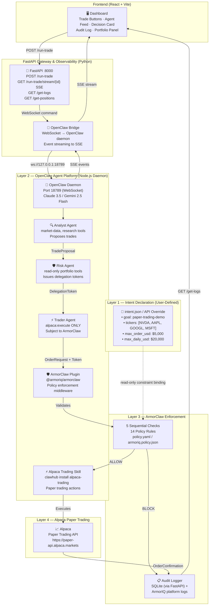

# AuraTrade — Multi-Agent AI Trading Safety System
## Architecture Document v3.0 (Hackathon Revision)

> **System Name:** AuraTrade  
> **Agent Platform:** OpenClaw (Node.js daemon + ArmorClaw plugin)  
> **Enforcement Layer:** ArmorClaw (`@armoriq/armorclaw`)  
> **Trading Skill:** Alpaca Trading Skill (ClawHub)  
> **Primary LLM:** Claude 3.5 Sonnet (Recommended) / Gemini 2.5 Flash (Demo Default)  
> **Status:** Paper Trading Only — No Real Money

---

## Table of Contents

1. [System Overview](#1-system-overview)
2. [What OpenClaw Actually Is](#2-what-openclaw-actually-is)
3. [Layer Diagram](#3-layer-diagram)
4. [Component Breakdown](#4-component-breakdown)
5. [Agent Specifications](#5-agent-specifications)
6. [ArmorClaw Enforcement Flow](#6-armorclaw-enforcement-flow)
7. [Policy Rules Reference](#7-policy-rules-reference)
8. [Delegation Token Lifecycle](#8-delegation-token-lifecycle)
9. [OpenClaw Setup & Integration](#9-openclaw-setup--integration)
10. [Happy Path Trace — BUY NVDA $4000](#10-happy-path-trace--buy-nvda-4000)
11. [Blocked Path Trace — BUY NVDA $8000](#11-blocked-path-trace--buy-nvda-8000)
12. [Audit Log Schema](#12-audit-log-schema)
13. [Directory Structure](#13-directory-structure)
14. [API Endpoint Reference](#14-api-endpoint-reference)
15. [Frontend Component Tree](#15-frontend-component-tree)
16. [Setup & Run Instructions](#16-setup--run-instructions)
17. [Policy Configuration (policy.yaml)](#17-policy-configuration-policyyaml)
18. [Security Assumptions & Limitations](#18-security-assumptions--limitations)
19. [Multi-LLM Support](#19-multi-llm-support)

---

## 1. System Overview

AuraTrade is a multi-agent AI trading safety system engineered around a _safety-first, enforcement-first_ design philosophy.

**The core insight:** Separate _intelligence_ (agents reasoning about what to do) from _execution authority_ (ArmorClaw as the only entity that can authorize real trades).

```
User Intent (Configurable Intent Boundaries)
        ↓
OpenClaw Agent Platform (Analyst → Risk → Trader pipeline)
        ↓
ArmorClaw Plugin (5 sequential checks, 14 policy rules)
        ↓
Alpaca Paper Trading API (only receives ArmorClaw-approved orders)
```

Even a fully compromised or hallucinating agent **cannot** place an unauthorized order — because it never talks to Alpaca directly. Every order goes through ArmorClaw first.

---

## 2. What OpenClaw Actually Is

> **Critical clarification for anyone reading this code:**

OpenClaw is **not a Python library**. It is a **Node.js autonomous AI agent platform** — a persistent daemon that runs on your machine, connects to messaging platforms (Telegram, Slack, Discord, etc.), and executes tasks using a skill/tool system.

```
Traditional assumption:          Reality:
─────────────────────────        ────────────────────────────────────────
from openclaw import ...   →     npm install -g openclaw
Python agent classes       →     Node.js daemon (openclaw onboard)
pip install armorclaw      →     openclaw plugins install @armoriq/armorclaw
Roll-your-own tools        →     clawhub install alpaca-trading (pre-built skill)
Custom policy code         →     ~/.openclaw/armoriq.policy.json (declarative)
```

**ArmorClaw** is the `@armoriq/armorclaw` npm plugin published by [ArmorIQ](https://armoriq.ai). It installs into the OpenClaw runtime and intercepts every tool call before execution — acting as a cryptographic firewall. Policy is defined in a structured JSON/YAML file, not in `if/else` code.

---

## 3. Layer Diagram



---

## 4. Component Breakdown

### Layer 0 — Frontend Dashboard (React + Vite)

| Component | Responsibility |
|-----------|---------------|
| Trade Trigger Panel | Two buttons: "Run Allowed Trade (BUY NVDA $4K)" and "Trigger Blocked Trade (BUY NVDA $8K)" |
| Agent Activity Feed | SSE stream showing real-time Analyst → Risk → Trader → ArmorClaw event flow |
| ArmorClaw Decision Card | Animated ALLOW (green) or BLOCK (red) with rule IDs and block reason |
| Audit Log Table | Live-polling table of all SQLite audit entries with ALLOW/BLOCK filter |
| Portfolio Panel | Alpaca positions + total equity, refreshed every 10 seconds |

### Layer 1 — Intent Declaration (User-Defined Boundaries)

| Component | Responsibility | Interface |
|-----------|---------------|-----------|
| `intent.json` | Single source of truth for ALL policy constraints | Configurable file; hash verified by ArmorClaw on every request |
| Intent Loader | Validates `intent.json` against Pydantic schema at FastAPI startup | Raises `IntentValidationError` on schema mismatch |

**Dynamic Support:** AuraTrade supports dynamic intent overrides via the API, allowing users to adjust boundaries (e.g., lower caps during volatility) while maintaining cryptographic integrity via the `intent_token_id`.

### Layer 2 — OpenClaw Agent Platform

| Component | Responsibility |
|-----------|---------------|
| **OpenClaw Daemon** | Node.js runtime (`~/openclaw-armoriq/`), runs on port 18789 |
| **ArmorClaw Plugin** | `@armoriq/armorclaw` npm plugin — intercepts every tool call as middleware |
| **Alpaca Trading Skill** | ClawHub skill providing `alpaca:place_order`, `alpaca:get_positions`, `alpaca:get_account` |
| **Claude 3.5 Sonnet** | **Recommended** ecosystem-native LLM for production-grade tool use |
| **Gemini 2.5 Flash** | **Demo Default** used for high-speed, high-limit hackathon performance |
| **Analyst Agent** | Proposes trades using `market-data` and `research` tools |
| **Risk Agent** | Reads portfolio (read-only) and issues HMAC-signed delegation tokens |
| **Trader Agent** | Submits orders to ArmorClaw (never directly to Alpaca) |

### Layer 3 — ArmorClaw Enforcement Engine

| Component | Responsibility |
|-----------|---------------|
| **Check Engine** | Runs 5 sequential enforcement checks against every order |
| **Policy Evaluator** | **Primary Authority:** Applies 14 named rules from `armoriq.policy.json` |
| **Audit Log Writer** | Writes to both ArmorIQ platform logs and our SQLite for dashboard display |
| **Token Validator** | HMAC-SHA256 signature verification, expiry check, replay protection |
| **Intent Binder** | Compares order fields against loaded `intent.json` constraints |

### Layer 4 — Alpaca Paper Trading

| Component | Responsibility |
|-----------|---------------|
| Alpaca REST Client | Submits ArmorClaw-approved orders; fetches positions/account via ClawHub skill |
| Position Cache | Short-lived (5s TTL) position cache in our FastAPI Gateway |

---

## 5. Agent Specifications

| Agent | Role | Allowed Tools | Cannot Do | Output |
|-------|------|--------------|-----------|--------|
| **Analyst** | Market Intelligence | `market-data`, `research` | Access accounts, place orders, issue tokens | `TradeProposal { ticker, action, amount_usd, rationale, confidence }` |
| **Risk Agent** | Exposure Gatekeeper | `alpaca:get_positions`, `alpaca:get_account`, `calculate_exposure` | Execute trades, write data, propose trades | `DelegationToken { approved_by, action, ticker, max_amount_usd, expiry, signature }` or `RejectionReason` |
| **Trader** | Order Executor | `alpaca:execute` ONLY (gated by ArmorClaw) | Read market data, propose trades, issue tokens | `OrderRequest` → on ALLOW: `OrderConfirmation`; on BLOCK: `BlockedOrderRecord` |

---

## 6. ArmorClaw Enforcement Flow

ArmorClaw intercepts every outbound tool call and runs five checks **in strict sequence**. Failure at any check immediately blocks the order.

```
Tool call arrives at ArmorClaw middleware
       │
       ▼
┌─────────────────────────────────────────────────────────┐
│  CHECK 1 — Intent Binding Verification                  │
│  • Verify order ticker ∈ authorized_tickers             │
│  • Verify order amount ≤ max_order_usd                  │
│  • Verify intent_token_id matches loaded intent.json    │
└─────────────────────────────────────────────────────────┘
       │ PASS
       ▼
┌─────────────────────────────────────────────────────────┐
│  CHECK 2 — Delegation Token Validation                  │
│  • Verify HMAC-SHA256 signature                         │
│  • Verify expiry > now (60s TTL)                        │
│  • Verify approved_by == "RiskAgent"                    │
└─────────────────────────────────────────────────────────┘
       │ PASS
       ▼
┌─────────────────────────────────────────────────────────┐
│  CHECK 3 — Exposure & Concentration                     │
│  • Post-trade single-ticker concentration < 40%         │
│  • Post-trade sector exposure < 60%                     │
│  • Daily spend so far + order ≤ max_daily_usd           │
└─────────────────────────────────────────────────────────┘
       │ PASS
       ▼
┌─────────────────────────────────────────────────────────┐
│  CHECK 4 — Regulatory & Temporal Rules                  │
│  • NYSE market hours: 09:30–16:00 ET, Mon–Fri           │
│  • Simulated: No earnings blackout window for demo      │
└─────────────────────────────────────────────────────────┘
       │ PASS
       ▼
┌─────────────────────────────────────────────────────────┐
│  CHECK 5 — Data & Tool Access Audit                     │
│  • Confirm order origin: TraderAgent                    │
│  • Confirm no restricted data class accessed            │
│  • Confirm Trader used only alpaca:execute              │
└─────────────────────────────────────────────────────────┘
       │ ALLOW
       ▼
  Forward to Alpaca Paper Trading API
```

---

## 7. Policy Rules Reference (The 14-Rule Suite)

Rules are enforced **autonomously** by the ArmorClaw plugin (`armoriq.policy.json`). The FastAPI Gateway provides **Defense-in-Depth** by redundant Python-level verification.

| Rule ID | Group | What It Checks | Block Condition |
|---------|-------|---------------|-----------------|
| `trade-size-limits` | Trade & Exposure | Order amount vs `max_order_usd` | `order_usd > 5000` |
| `daily-spend-limit` | Trade & Exposure | Cumulative daily spend | `daily_spent + order_usd > 20000` |
| `portfolio-concentration-limit` | Trade & Exposure | Post-trade % of single ticker | Ticker exceeds 40% of portfolio |
| `sector-exposure-limit` | Trade & Exposure | Post-trade sector weight | Tech sector exceeds 60% of portfolio |
| `ticker-universe-restriction` | Ticker & Asset | Ticker vs `authorized_tickers` | Ticker not in `["NVDA","AAPL","GOOGL","MSFT"]` |
| `market-hours-only` | Time & Regulatory | Timestamp vs NYSE hours | Request outside 09:30–16:00 ET Mon–Fri |
| `earnings-blackout-window` | Time & Regulatory | Simulated Earnings Calendar | **Demo Stability:** Pass for NVDA/AAPL/GOOGL/MSFT |
| `wash-sale-prevention` | Time & Regulatory | Last sell date vs today | Sell within 30 days of prior loss sale |
| `data-class-protection` | Data & File | Data classification access | RESTRICTED/CONFIDENTIAL data accessed |
| `directory-scoped-access` | Data & File | File system paths | Access outside scoped directory |
| `tool-restrictions` | Agent Role & RBAC | Tool calls vs agent's role | Agent called a tool not in its allowlist; includes **RiskAgent Read-Only** constraint |
| `delegation-scope-enforcement` | Delegation & Role | Token fields vs order fields | Token ticker/action mismatch |
| `agent-role-binding` | Delegation & Role | Order origin agent identity | Order not from Trader agent |
| `intent-token-binding` | Delegation & Role | Intent hash integrity | possible intent.json tampering |

---

## 8. Delegation Token Lifecycle

### 8.1 Schema

```json
{
  "token_id":               "uuid-v4",
  "approved_by":            "RiskAgent",
  "action":                 "BUY",
  "ticker":                 "NVDA",
  "max_amount_usd":         4000,
  "expiry":                 "2024-01-15T14:31:00Z",
  "handoff_count":          1,
  "intent_token_id":        "auratrade-intent-v1-2024",
  "signature":              "<HMAC-SHA256 of all above fields>"
}
```

---

## 9. OpenClaw Setup & Integration

### 9.1 Architecture of the Integration

The FastAPI server acts as the **Gateway & Observability Layer**, providing:
1. **Unified Frontend API** for the React dashboard.
2. **Real-time Event Streaming** (SSE) for agent transparency.
3. **Audit Persistence** via local SQLite.
4. **Defense-in-Depth** via redundant policy verification.

### 9.2 Installation

**Step 2: Run the ArmorIQ installer**
```bash
curl -fsSL https://armoriq.ai/install-armorclaw.sh | bash -s -- \
  --gemini-key YOUR_GEMINI_API_KEY \
  --api-key YOUR_ARMORIQ_API_KEY \
  --no-prompt
```

### 9.3 Policy Configuration

> **Note:** The following is an illustrative snippet of the primary intent-binding rules. The full production policy file (`armoriq.policy.json`) contains the complete set of 14 rules.

```json
{
  "version": "1.0",
  "policies": [
    {
      "id": "ticker-universe-restriction",
      "type": "tool_restriction",
      "tool": "alpaca:place_order",
      "condition": "args.symbol NOT IN intent.authorized_tickers",
      "action": "block"
    },
    {
      "id": "intent-token-binding",
      "type": "integrity_check",
      "condition": "request.intent_token_id != system.loaded_intent_hash",
      "action": "block"
    }
  ]
}
```

---

## 10. Happy Path Trace — BUY NVDA $4000

1. **User** clicks "Run Allowed Trade" in Dashboard.
2. **Analyst** researches NVDA and proposes $4,000 BUY.
3. **Risk Agent** verifies exposure and issues **Delegation Token**.
4. **Trader** submits Order + Token to **ArmorClaw**.
5. **ArmorClaw** passes all 5 checks and allows the order.
6. **Alpaca** receives and executes the trade.

---

## 11. Blocked Path Trace — BUY NVDA $8000

1. **User** clicks "Trigger Blocked Trade" ($8,000 exceeds $5K cap).
2. **Analyst/Risk** pipeline proceeds as normal (Agents are intelligence, not authority).
3. **Trader** submits $8,000 Order to **ArmorClaw**.
4. **ArmorClaw Check 1** immediately fires `trade-size-limits` violation.
5. **Order BLOCKED** before reaching Alpaca. Dashboard reveals the red block card.

---

## 12. Audit Log Schema

| Field | Type | Description |
|-------|------|-------------|
| `decision` | `VARCHAR(10)` | `ALLOW` or `BLOCK` |
| `rule_id` | `TEXT` | Fired rule ID (e.g., `trade-size-limits`) |
| `proof_hash` | `VARCHAR(64)` | SHA-256 chain for tamper-evidence |

---

## 15. Frontend Component Tree

```
App.jsx
├── Route "/" → LandingPage
│   ├── <Navbar />
│   ├── <HeroSection />      ← Animated hero + AuraTrade tagline
│   ├── <StatsSection />     ← 14 rules, 5 checks, $5K cap, 3 agents (count-up anims)
...
```

---

## 18. Security Assumptions & Limitations

### ✅ What This System Protects Against
- **Oversized/Unauthorized trades** — Enforced by hard intent boundaries.
- **Agent privilege escalation** — RBAC enforced at the plugin layer.
- **Token forgery** — Cryptographically signed delegation tokens.
- **Audit tampering** — Chained proof-hashes.

### ⚠️ What This System Does NOT Cover (Planned Mitigations)
- **Prompt Injection:**
    - *Risk:* Malicious data in market feeds manipulating agent reasoning.
    - *AuraTrade Stance:* We plan to implement **Intent Verification**. ArmorClaw will compare an agent's *stated reasoning* against the *original user intent*. If reasoning deviates (e.g., "Buying due to suspicious social media pump"), the trade is blocked even if the order size is valid.
- **Earnings Blackout Data:**
    - *Constraint:* Real-time earnings calendars require premium API access.
    - *Demo Mitigation:* For the hackathon demo, the earnings blackout check is **simulated** (hardcoded to pass for authorized tickers) to ensure demo stability while showcasing the structural enforcement capability.
- **Multi-instance safety** — Requires Redis for used-token tracking in distributed setups.

---

## 19. Multi-LLM Support

AuraTrade is LLM-agnostic, configurable via `.env`:

| Provider | Setting | Context |
|----------|---------|---------|
| **Anthropic** | `LLM_PROVIDER=anthropic` | **Production (Native Ecosystem)** |
| **Google Gemini** | `LLM_PROVIDER=gemini` | **Hackathon / Demo Default** |
| OpenAI | `LLM_PROVIDER=openai` | General Purpose |

---

## Resources
- [OpenClaw GitHub](https://github.com/openclaw/openclaw)
- [ArmorIQ Platform](https://platform.armoriq.ai)
- [ClawHub Registry](https://clawhub.io)
