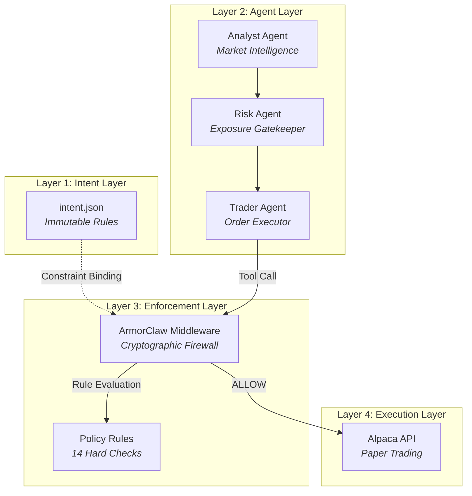
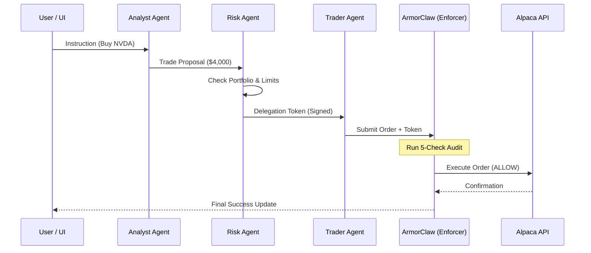
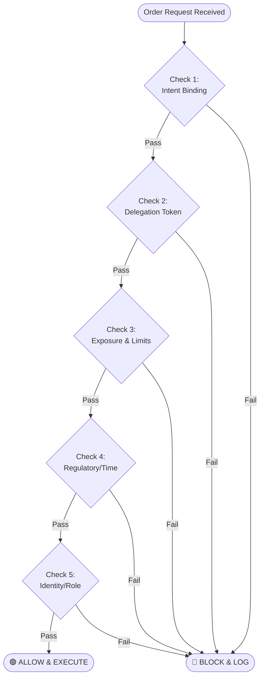

# AuraTrade: Multi-Agent AI Trading Architecture & Security Specification

## 1. 🧠 System in Simple Terms
AuraTrade is a high-security "security guard" for AI trading. Instead of giving an AI agent direct access to your bank account, the system breaks the trading process into three specialized AI interns (Analyst, Risk, and Trader) who must collaborate. Most importantly, a separate, un-hackable "Bouncer" (ArmorClaw) stands between these AIs and the stock market, checking a physical rulebook (Intent) to block any unauthorized or dangerous orders before they can be executed.

---

## 2. 🏗️ High-Level Architecture
The system is divided into four distinct layers, ensuring that intelligence is decoupled from execution authority.

---

## 3. 🧩 Key Concepts (For Beginners)
... (rest of section) ...

---

## 4. 🔁 Full System Flow (Sequential)
This diagram illustrates the "Happy Path" where an authorized trade flows through the multi-agent pipeline and passes enforcement.

---

## 5. 🛡️ Enforcement Logic (The Decision Tree)
ArmorClaw uses a deterministic decision tree. If any check fails, the trade is instantly killed.

---

## 6. 🏗️ System Architecture (Step-by-Step)
... (rest of file) ...

### Layer 1: Intent Layer (`intent.json`)
*   **What it does:** Stores the user's absolute financial boundaries (Allowed tickers, Max order size).
*   **Why it exists:** To ensure that even if the AI "goes crazy," it cannot theoretically spend more than the user explicitly allowed.
*   **Failure Risk:** If this file is tampered with, the system detects a "Hash Mismatch" and halts all operations.

### Layer 2: Agent Layer (OpenClaw Agents)
*   **What it does:** The "Reasoning" center. The **Analyst** finds trades, the **Risk Agent** approves them, and the **Trader** submits them.
*   **Why it exists:** Separation of duties. One agent's mistake (e.g., a hallucination) is caught by the others in the pipeline.
*   **Failure Risk:** An agent could be "hacked" via prompt injection, but it still lacks the authority to bypass the next layer.

### Layer 3: Enforcement Layer (ArmorClaw)
*   **What it does:** The "Cryptographic Firewall." It intercepts every "Tool Call" (like `place_order`) before it hits the internet.
*   **Why it exists:** To provide a deterministic, non-AI check on every action. It doesn't "chat"; it simply validates.
*   **Failure Risk:** This is the most critical layer. In AuraTrade, it is a mandatory plugin that cannot be bypassed by the agents.

### Layer 4: Execution Layer (Alpaca API)
*   **What it does:** The final connection to the paper trading brokerage.
*   **Why it exists:** To convert approved digital intent into actual market positions.

---

## 4. 🔁 Full System Flow
1.  **Instruction:** User triggers a "Buy NVDA" request from the Dashboard.
2.  **Analysis:** The **Analyst Agent** researches NVDA and proposes a $4,000 buy.
3.  **Risk Audit:** The **Risk Agent** checks if the user has enough money and if NVDA is allowed.
4.  **Token Issuance:** The Risk Agent signs a **Delegation Token** (HMAC-SHA256) specifying: *BUY, NVDA, $4,000, 60s Expiry*.
5.  **Submission:** The **Trader Agent** receives the token and attempts to call the `alpaca:execute` tool.
6.  **Interception:** **ArmorClaw** stops the tool call and runs its 5-Check Audit (Intent, Token, Exposure, Regulatory, Identity).
7.  **Final Verdict:** If all checks pass, the order is forwarded to Alpaca. If any fail, the order is **BLOCKED** and logged.

---

## 5. ✅ Allowed Action Example (BUY NVDA $4,000)
*   **Analyst:** Recommends NVDA based on market trends.
*   **Risk:** Sees the $4,000 request is under the $5,000 limit in `intent.json`. Signs a token.
*   **Enforcement:** ArmorClaw verifies the signature, confirms the market is open, and sees that $4,000 doesn't exceed portfolio concentration limits.
*   **Result:** **ALLOW**. The trade is placed on Alpaca.

---

## 6. ❌ Blocked Action Example (BUY NVDA $8,000)
*   **Analyst:** Hallucinates and proposes an $8,000 trade.
*   **Risk:** Might erroneously sign a token for $8,000.
*   **Enforcement:** ArmorClaw hits **Check 1 (Intent Binding)**. It sees `$8,000 > max_order_usd: 5000`.
*   **Result:** **BLOCK**. Rule `trade-size-limits` triggers. The trade never leaves the server.

---

## 7. 🔐 Delegation System
The **Delegation Token** is a cryptographic "Hall Pass."
*   **Fields:** Ticker, Action, Max Amount, Expiry, and a Secret HMAC Signature.
*   **Without this:** A "rogue" Trader Agent could change a $10 Apple buy into a $10,000 Apple buy. The token prevents this because the "Bouncer" only allows the **exact** amount signed by the Risk Agent.

---

## 8. 🛡️ Enforcement Logic (Determinism)
Enforcement is not a "maybe." It follows a strict 1-5 sequence of checks.
*   **Same Input = Same Result.** Unlike LLMs, which might be inconsistent, ArmorClaw uses standard code logic to ensure that a violation of the rulebook *always* results in a block.

---

## 9. 📊 Logging & Traceability
Every decision is logged to an append-only SQLite database.
*   **Proof Hash:** Each log entry is cryptographically linked to the previous one (a "Hash Chain").
*   **Why it matters:** It creates an untamperable audit trail. If a user tries to delete a "Block" log to hide an error, the chain breaks, signaling an integrity failure.

---

## 10. 🚨 Security & Risk Mitigation
*   **Unauthorized Trades:** Blocked by the `ticker-universe-restriction` rule.
*   **Prompt Injection:** The system ignores the "reasoning" and only judges the final "Tool Call" payload.
*   **Agent Rogue:** Check 5 (`agent-role-binding`) ensures only the "Trader" agent can execute trades.
*   **Data Misuse:** `data-class-protection` prevents agents from sending sensitive strings (like API keys) to external APIs.

---

## 11. ⚔️ Comparison: Typical AI vs. AuraTrade
| Feature | Typical AI System | AuraTrade |
| :--- | :--- | :--- |
| **Safety** | "Please don't do bad things." | "You are physically unable to do bad things." |
| **Keys** | Agent has the API Key. | Only the Enforcement Layer has the Key. |
| **Trust** | Trust the model's logic. | Trust the user's code-level Policy. |

---

## 12. ⚠️ Known Weaknesses & Risks
1.  **Secret Management:** The HMAC secret is currently in `.env`. (⚠️ **Missing: Hardware Security Module (HSM) for key storage**).
2.  **Data Quality:** If the "Analyst" receives manipulated market data, it might propose a "legal" but "bad" trade.
3.  **Centralization:** The OpenClaw bridge is the single point of failure; if the bridge is bypassed, security is lost.

---

## 13. 🧠 Final 30-Second Pitch
"AuraTrade is a multi-agent trading system where AI agents do the work, but are physically blocked from unauthorized actions by a cryptographic 'Bouncer' (ArmorClaw). It ensures that every trade is verified against immutable user rules (Intent) and digital signatures (Tokens) before a single cent is spent, making autonomous trading genuinely safe for the first time."
